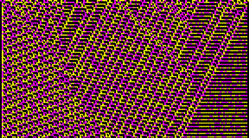
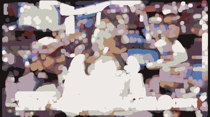
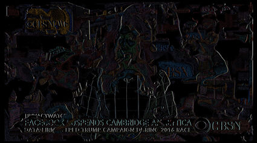
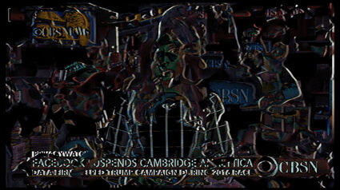
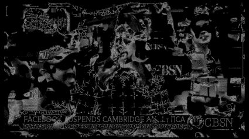

# Experimental Image Dithering w/ImageMagick

## Install

```sh
brew install imagemagick
```

## Basic Command

```sh
convert input.png -dither Riemersma output.png
// or 
convert input.png -dither FloydSteinberg output.png
```

## Monochrome
```sh
convert input.png -monochrome -dither Riemersma output.png
// or 
convert input.png -monochrome -dither FloydSteinberg output.png
```


## Posterize
When using the `-posterize` option you need to add a level. Low numbers like 2, 3, 4, 5 have the most effect. [→ Official Reference](https://imagemagick.org/script/command-line-options.php#posterize)

```sh
convert input.png -posterize 2 -dither FloydSteinberg output.png
```


## Remap
Reduce the number of colors in an image to the colors used by another image (e.g. remapImage.png). [→ Official Reference](https://imagemagick.org/script/command-line-options.php#remap%20)

```sh
convert input.png -remap remapImage.png -dither FloydSteinberg output.png
```


The remap (input) image


The output image


## Color Reduction
Set the preferred number of colors in the image. [→ Official Reference](https://imagemagick.org/script/command-line-options.php#colors)

```sh
convert input.png -colors 4 -dither FloydSteinberg output.png
```


2 Colors


5 Colors


10 Colors

## Threshold Map
Use `-ordered-dither` to apply threshold mapped dither patterns, using uniform color maps, rather than specific color maps. [→ Official Reference.](https://imagemagick.org/script/command-line-options.php#ordered-dither)

```sh
convert input.png -colors 10 -ordered-dither o2x2 -dither FloydSteinberg output.png
```


`-ordered-dither checks`


`-ordered-dither h4x4a`


`-ordered-dither h8x8a`


`-ordered-dither o2x2`

Use `convert list -threshold` to see all available thresholds.

# Morphology

## Dilate
```sh 
convert input.png -colors 10 -morphology Dilate Octagon:10 -dither FloydSteinberg output.jpg
```



## Hit & Miss

The 'Hit-And-Miss' morphology method, also commonly known as "HMT" in computer science literature, is a high level morphology method that is specifically designed to find and locate specific patterns in images. It does this by looking for a specific configuration of 'foreground' and 'background' pixels around the 'origin'. [→ Official Reference.](https://legacy.imagemagick.org/Usage/morphology/#hmt)

```sh
convert input.png -colors 10 -morphology Hit-and-Miss '2x1:1,0' -dither FloydSteinberg output.jpg
// or 
convert input.png -colors 10 -morphology Hit-and-Miss '3x1:1,-,0' -dither FloydSteinberg output.jpg
```



## Thinning

This method subtracts them from the original image. [→ Official Reference.](https://legacy.imagemagick.org/Usage/morphology/#thinning)

```sh
convert input.png -colors 10 -morphology Thinning '10x1+1+0:1,1,1,1,1,1,1,1,1,1' output.jpg
```



### Skeleton

Create a *Skeleton* from your image. This works best when you make your images monochrome first. [→ Official Reference.](https://legacy.imagemagick.org/Usage/morphology/#thinning_skeleton)
```sh
convert input.png -monochrome -morphology Thinning:-1 Skeleton output.jpg
```



# Resources

* [Official Docs](https://imagemagick.org/script/command-line-options.php#dither)